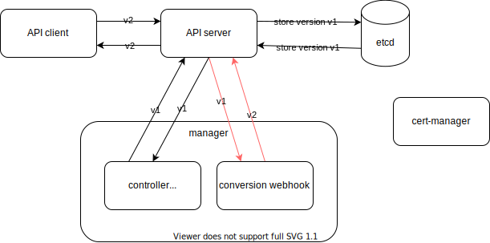

## Multi-Version API

In Kubernetes, all versions must be safely round-tripable through each other.

### 2.1. [Changing things up](https://book.kubebuilder.io/multiversion-tutorial/api-changes.html)


1. Create version v2.

    ```
    kubebuilder create api --group batch --version v2 --kind CronJob
    ```

    <details>

    ```
    Create Resource [y/n]
    y
    Create Controller [y/n]
    n
    Writing kustomize manifests for you to edit...
    Writing scaffold for you to edit...
    api/v2/cronjob_types.go
    Update dependencies:
    $ go mod tidy
    Running make:
    $ make generate
    /Users/masato-naka/repos/nakamasato/kubebuilder-cronjob-controller/bin/controller-gen object:headerFile="hack/boilerplate.go.txt" paths="./..."
    Next: implement your new API and generate the manifests (e.g. CRDs,CRs) with:
    $ make manifests
    ```

    </details>

1. Add the marker `+kubebuilder:storageversion` for storage version to [api/v1/cronjob_types.go](api/v1/cronjob_types.go)

    > Since we’ll have more than one version, we’ll need to mark a storage version. This is the version that the Kubernetes API server uses to store our data. We’ll chose the v1 version for our project.

    > We’ll use the `+kubebuilder:storageversion` to do this.

1. Other than `Schedule CronSchedule `json:"schedule"`, same as `v1`.
1. Commit the change.

### 2.2. [Hubs, spokes, and other wheel metaphors](https://book.kubebuilder.io/multiversion-tutorial/conversion-concepts.html)

Conversion functions to convert between each of our versions are necessary. -> **conversion webhook**

> controller-runtime models conversion in terms of a **“hub and spoke” model**
if we have to convert between two non-hub versions, we first convert to the hub version, and then to our desired version


> When API clients, like kubectl or your controller, request **a particular version** of your resource, the Kubernetes API server needs to return a result that’s of that version. However, that version might not match **the version stored** by the API server.

> In that case, the API server needs to know how to convert between the desired version and the stored version. Since the conversions aren’t built in for CRDs, the Kubernetes API server calls out to a webhook to do the conversion instead.



### 2.3 [Implementing conversion](https://book.kubebuilder.io/multiversion-tutorial/conversion.html)


1. **implement the hub**: Add the following code to [api/v1/cronjob_conversion.go](api/v1/cronjob_conversion.go)

    ```go
    // Hub marks this type as a conversion hub.
    func (*CronJob) Hub() {}
    ```

1. **implement spokes**: need to implement the [Convertible](https://pkg.go.dev/sigs.k8s.io/controller-runtime/pkg/conversion?tab=doc#Convertible) interface (Namely `ConvertTo` and `ConvertFrom` methods) in [api/v2/cronjob_conversion.go](api/v2/cronjob_conversion.go).

### 2.3.1 [Setting up the webhooks](https://book.kubebuilder.io/multiversion-tutorial/webhooks.html)

1. No change in api/v1.
    `kubebuilder create webhook --group batch --version v1 --kind CronJob --conversion` -> fails as we already have a webhook.

    No need to do anything as our types implement the [Hub](https://pkg.go.dev/sigs.k8s.io/controller-runtime/pkg/conversion#Hub) and [Convertible](https://pkg.go.dev/sigs.k8s.io/controller-runtime/pkg/conversion#Convertible) interfaces.
1. [main.go](main.go) <- no need of change.


The configuration of conversion webhook is defined in CRD:

```yaml
# The following patch enables a conversion webhook for the CRD
apiVersion: apiextensions.k8s.io/v1
kind: CustomResourceDefinition
metadata:
  name: cronjobs.batch.tutorial.kubebuilder.io
spec:
  conversion:
    strategy: Webhook
    webhook:
      clientConfig:
        service:
          namespace: system
          name: webhook-service
          path: /convert
      conversionReviewVersions:
      - v1
```

### 2.4. [Deployment and Testing](https://book.kubebuilder.io/multiversion-tutorial/deployment.html)

1. Confirm webhook and certmanager in `config/crd/kustomization.yaml` and `config/default/kustomization.yaml`.
1. Add `CRD_OPTIONS ?= "crd"` to `Makefile`.
1. Deploy cert-manager.
    ```
    kubectl apply -f https://github.com/cert-manager/cert-manager/releases/download/v1.7.1/cert-manager.yaml
    ```
1. Build
    ```
    IMG=kubebuilder-cronjob-controller
    make docker-build IMG=$IMG
    ```
1. Install and deploy.

    ```
    make install deploy IMG=$IMG
    /Users/masato-naka/repos/nakamasato/kubebuilder-cronjob-controller/bin/controller-gen rbac:roleName=manager-role crd webhook paths="./..." output:crd:artifacts:config=config/crd/bases
    /Users/masato-naka/repos/nakamasato/kubebuilder-cronjob-controller/bin/kustomize build config/crd | kubectl apply -f -
    The CustomResourceDefinition "cronjobs.batch.tutorial.kubebuilder.io" is invalid: metadata.annotations: Too long: must have at most 262144 bytes
    make: *** [install] Error 1
    ```
    https://github.com/kubernetes-sigs/kubebuilder/issues/1140 -> Chang `apply` -> `apply --server-side` in `Makefile`

    <details>

    ```diff
     .PHONY: install
     install: manifests kustomize ## Install CRDs into the K8s cluster specified in ~/.kube/config.
    -       $(KUSTOMIZE) build config/crd | kubectl apply -f -
    +       $(KUSTOMIZE) build config/crd | kubectl apply --server-side -f -

     .PHONY: uninstall
     uninstall: manifests kustomize ## Uninstall CRDs from the K8s cluster specified in ~/.kube/config. Call with ignore-not-found=true to ignore resource not found errors during deletion.
    @@ -97,7 +97,7 @@ uninstall: manifests kustomize ## Uninstall CRDs from the K8s cluster specified
     .PHONY: deploy
     deploy: manifests kustomize ## Deploy controller to the K8s cluster specified in ~/.kube/config.
            cd config/manager && $(KUSTOMIZE) edit set image controller=${IMG}
    -       $(KUSTOMIZE) build config/default | kubectl apply -f -
    +       $(KUSTOMIZE) build config/default | kubectl apply --server-side -f -
    ```

    ```
    make install deploy IMG=$IMG
    ```
1. Create CronJob with v2.
    ```
    kubectl apply -f config/samples/batch_v2_cronjob.yaml
    ```

1. Check with v1 and v2.

    ```
    kubectl get cronjobs.v1.batch.tutorial.kubebuilder.io -o jsonpath='{.items[].spec.schedule}'
    */1 * * * *%
    ```

    ```
    kubectl get cronjobs.v2.batch.tutorial.kubebuilder.io -o jsonpath='{.items[].spec.schedule}'
    {"minute":"*/1"}
    ```

## Questions
1. Why is conversion webhook for v2 is registered in [main.go](https://book.kubebuilder.io/multiversion-tutorial/webhooks.html#and-maingo)?
1. Need to execute `kubebuilder create webhook --group batch --version v2 --kind CronJob --conversion` to generate [api/v2/cronjob_webhook.go](https://github.com/kubernetes-sigs/kubebuilder/blob/master/docs/book/src/multiversion-tutorial/testdata/project/api/v2/cronjob_webhook.go) which contains `SetupWebhookWithManager`?
1. Without api/v2/cronjob_webhook.go, we could confirm the api conversion. necessary?

